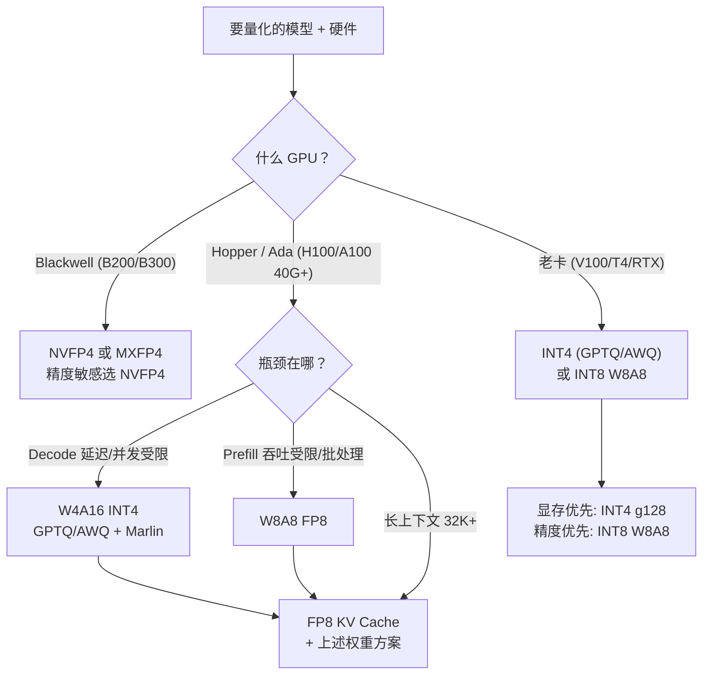

前面五节把量化的原理讲完了，这一节做两件事：**选型**——站在决策者的位置，根据硬件、模型、业务诉求选出正确的量化组合；**实战**——用 vLLM（v0.26.0）把选好的方案真正跑起来，包括怎么产量化模型、怎么启动、怎么验证质量、以及生产里最常见的坑。

这一节是全章的"验收出口"：读完你应该能回答"我手里有 XX 卡、要跑 XX 模型、要 XX 延迟/吞吐，该用什么量化"，并且能自己动手把它部署上线。

<!-- more -->

## 📑 目录

- [1. 选型决策树：先看硬件，再看瓶颈](#1-选型决策树先看硬件再看瓶颈)
- [2. 四个场景的典型配方](#2-四个场景的典型配方)
- [3. vLLM 量化生态总览（v0.26.0）](#3-vllm-量化生态总览v0260)
- [4. 产量化模型：llm-compressor 一条龙](#4-产量化模型llm-compressor-一条龙)
- [5. 启动服务：GPTQ / AWQ / FP8 / KV Cache 实战命令](#5-启动服务gptq--awq--fp8--kv-cache-实战命令)
- [6. 验证质量：量化后必须做的检查](#6-验证质量量化后必须做的检查)
- [7. 性能验证：量化到底值不值](#7-性能验证量化到底值不值)
- [8. 生产踩坑清单](#8-生产踩坑清单)
- [总结](#-总结)
- [自我检验清单](#-自我检验清单)
- [参考资料](#-参考资料)

---

## 1. 选型决策树：先看硬件，再看瓶颈

量化选型的第一原则：**硬件决定上限，瓶颈决定方案**。



拆解成四个问题：

1. **什么卡？** Blackwell 直接考虑 NVFP4/MXFP4（4-bit 浮点），Hopper/Ada 用 FP8 或 INT4，老卡（无 FP8 张量核）只能走 INT 路线
2. **什么瓶颈？** 在线聊天（Decode 主导）→ W4A16；离线批处理/长 Prompt 预处理（Prefill 主导）→ W8A8；两者都要 → 组合
3. **多长的上下文？** 32K+ 或并发要求高 → 必须加 KV Cache 量化
4. **精度预算？** 任务越难（代码、数学、长文推理）预算越紧 → 优先 FP8/NVFP4，其次 AWQ/GPTQ g128，避免 2-bit 激进方案

> 📌 **关键点**：选型不是"选一个量化"，而是**选一个组合**——权重量化 + KV Cache 量化 + （可选）激活量化。三个开关彼此独立，按需打开。

---

## 2. 四个场景的典型配方

| 场景 | 硬件 | 推荐配方 | 理由 |
|---|---|---|---|
| 70B 单卡在线服务 | 1×H100 80G | INT4 (AWQ) + FP8 KV Cache | 权重 37G + KV 压缩，Decode 吞吐最大化 |
| 8B 高并发 Chat 服务 | 多卡 H100 | FP8 W8A8（静态权重+动态激活） | 精度近乎无损，Prefill/Decode 双收益 |
| 128K 长文档 Agent | H100/Blackwell | INT4 + FP8 KV Cache（或 NVFP4 + FP8 KV） | KV 是绝对大头，压缩 KV 优先级最高 |
| 405B 大模型批处理 | GB300 NVL72 | NVFP4 | 显存/算力/精度三者最均衡 |

一句话记忆：**"能用 FP8 就别折腾 INT，有 Blackwell 就上 NVFP4，长上下文必加 KV 量化，纯 Decode 场景 INT4 最划算。"**

---

## 3. vLLM 量化生态总览（v0.26.0）

vLLM 支持的全部量化方法（`--quantization` 可选值节选）：

| 类别 | 方法 | 说明 |
|---|---|---|
| INT4 weight-only | `gptq_marlin` / `gptq`、`awq_marlin` / `awq`、`moe_wna16` | GPTQ/AWQ 生态，Marlin 内核 |
| FP8 W8A8 | `fp8`、`compressed-tensors`（W8A8-FP8） | 通用性最好 |
| FP8 块级 | `mxfp8`（MXFP8） | Blackwell 32 元素 block scale |
| FP4 | `modelopt_fp4`（NVFP4）、`mxfp4`、`petit_nvfp4` | Blackwell |
| 其它 | `gguf`、`bitsandbytes`、`torchao`、`quark`、`inc`、`online` | 生态补充 |

硬件支持矩阵（官方文档，2026-07）：

| 方法 | Volta | Turing | Ampere | Ada | Hopper | AMD GPU |
|---|---|---|---|---|---|---|
| AWQ | ❌ | ✅ | ✅ | ✅ | ✅ | ❌ |
| GPTQ | ✅ | ✅ | ✅ | ✅ | ✅ | ❌ |
| Marlin（GPTQ/AWQ/FP8/FP4） | ❌ | ✅* | ✅ | ✅ | ✅ | ❌ |
| llm-compressor FP8 (W8A8) | ❌ | ❌ | ❌ | ✅ | ✅ | ✅ |
| NVFP4/MXFP4 | ❌ | ❌ | ❌ | ❌ | ❌ | 部分 |

\* Turing 不支持 Marlin MXFP4

> 💡 **提示**：矩阵的意义不在于背下来，而在于理解模式——**INT 方案覆盖老硬件，FP8 从 Ada/Hopper 起，FP4 只有 Blackwell**。选型第一步（看硬件）对应这张表，第二步（看瓶颈）对应第 1 节决策树。

---

## 4. 产量化模型：llm-compressor 一条龙

vLLM 官方推荐用 **llm-compressor** 产出量化模型（AWQ/GPTQ/FP8/NVFP4/MXFP4 都支持），产出格式为 compressed-tensors，vLLM 加载零配置。

### 4.1 安装与最小示例

```bash
pip install llmcompressor
```

```python
from transformers import AutoModelForCausalLM, AutoTokenizer
from llmcompressor import oneshot
from llmcompressor.modifiers.quantization import QuantizationModifier

MODEL_ID = "meta-llama/Llama-3.1-8B-Instruct"
DATASET = "HuggingFaceH4/ultrachat_200k"

model = AutoModelForCausalLM.from_pretrained(MODEL_ID, torch_dtype="auto")
tokenizer = AutoTokenizer.from_pretrained(MODEL_ID)

# 1) FP8 W8A8（无需校准集也可跑，但给了更稳）
recipe = QuantizationModifier(
    targets=["Linear"], scheme="W8A8-FP8",
    ignore=["lm_head"],  # 输出层保持高精度，经验法则
)

# 2) INT4 W4A16（AWQ 风格）
# recipe = QuantizationModifier(targets=["Linear"], scheme="W4A16", 
#                               strategy="group", group_size=128)

oneshot(model=model, dataset=DATASET, recipe=recipe,
        max_seq_length=2048, num_calibration_samples=512)

out = "Llama-3.1-8B-Instruct-FP8"
model.save_pretrained(out, save_compressed=True)
tokenizer.save_pretrained(out)
```

要点：

- `targets=["Linear"]` 覆盖所有线性层；`ignore=["lm_head"]` 是通用经验（lm_head 精度对生成质量影响大，vLLM 0.26 还新增 `head_dtype` 参数支持 fp32 lm_head）
- `scheme` 可选：`W8A8-FP8`、`W8A8-INT8`、`W4A16`（GPTQ/AWQ）、`NVFP4`、`MXFP4` 等
- GPTQ/AWQ 也集成在 llm-compressor 里（`GPTQModifier` / `AWQModifier`），AutoAWQ/GPTQModel 是另一条等效路线

### 4.2 生产常用组合

```python
# KV Cache 也一起量化（FP8，per-head 策略，需 FA 后端）
from compressed_tensors.quantization import QuantizationArgs, QuantizationScheme
fp8_args = QuantizationArgs(num_bits=8, type="float", strategy="attn_head")
recipe = QuantizationModifier(
    config_groups={"attention": QuantizationScheme(
        targets=["LlamaAttention"], input_activations=fp8_args)},
    kv_cache_scheme=fp8_args,
)
```

---

## 5. 启动服务：GPTQ / AWQ / FP8 / KV Cache 实战命令

### 5.1 GPTQ / AWQ（INT4）

```bash
# GPTQ 模型（HuggingFace 上找带 gptq 后缀的模型）
vllm serve TheBloke/Llama-2-7B-Chat-GPTQ \
  --quantization gptq_marlin \
  --max-model-len 8192

# AWQ 模型
vllm serve TheBloke/Llama-2-7B-Chat-AWQ \
  --quantization awq_marlin \
  --max-model-len 8192
```

⚠️ **注意**：模型目录里带 `quantization_config` 时 vLLM 会自动识别格式，`--quantization` 可省略；显式指定时用 marlin 变体（`gptq_marlin`/`awq_marlin`）可拿到最快内核。

### 5.2 FP8 W8A8

```bash
# 方式 A：加载已量化的 FP8 模型（llm-compressor 产出）
vllm serve <fp8-model-dir> --quantization fp8

# 方式 B：在线量化（FP16 模型 + 动态 per-token 激活 scale）
vllm serve meta-llama/Llama-3.1-8B-Instruct --quantization fp8
```

方式 B 是"零成本试 FP8"的路径——vLLM 在加载时用 FP8 计算但不预先量化权重，激活动态量化；注意这种方式激活 scale 是动态的，权重精度取决于模型本身分布，一般能用但不如离线校准稳。

### 5.3 KV Cache 量化（叠加在任何方案上）

```bash
# FP8 KV Cache + 随机 Token 在线校准 scale
vllm serve <model> --kv-cache-dtype fp8 --calculate-kv-scales

# FP8 KV Cache + 跳过敏感层
vllm serve <model> --kv-cache-dtype fp8 \
  --kv-cache-dtype-skip-layers sliding_window

# FP8 KV Cache + 模型自带校准 scale（llm-compressor 产出）
vllm serve <model> --kv-cache-dtype fp8
```

### 5.4 NVFP4（Blackwell）

```bash
# NVIDIA Model Optimizer 产出的 NVFP4 模型
vllm serve <nvfp4-model-dir> --quantization modelopt_fp4
```

### 5.5 Python API 等价写法

```python
from vllm import LLM

llm = LLM(
    model="TheBloke/Llama-2-7B-Chat-AWQ",
    quantization="awq_marlin",
    kv_cache_dtype="fp8",
    calculate_kv_scales=True,      # 与 KV 量化配合
    max_model_len=8192,
)
```

---

## 6. 验证质量：量化后必须做的检查

量化上线前，用"同一批问题"对比量化前后模型，至少做三层检查：

### 6.1 语言模型困惑度（最低标准）

用 lm-eval-harness 跑 WikiText 或任务子集：

```bash
lm_eval --model hf --model_args pretrained=<量化模型>,dtype=float16 \
  --tasks wikitext --batch_size auto
```

困惑度漂移超过 0.5-1.0（或相对变化 >5%）需要警惕，尤其是小模型。

### 6.2 任务准确率（中档）

跑 5-10 个有代表性的任务（代码 HumanEval、数学 GSM8K、常识 MMLU 子集），对比 FP16 基线。**业务最相关的任务优先**——如果你们的产品是代码助手，HumanEval 比 MMLU 重要得多。

### 6.3 业务侧真实样例（必须）

跑 20-50 条线上真实请求，人工或规则比对：

- 输出是否变短、重复、出现格式错乱（量化后常见症状）
- 长上下文（接近模型上限）是否崩坏——KV Cache 量化的失效常在这里暴露
- 工具调用/结构化输出（JSON schema）是否出错率高

> 📌 **关键点**：量化验证的本质是"在你的数据分布上确认无感知差异"。论文里的平均困惑度不能替代你自己的 50 条业务样例——**验证的成本远低于线上事故的成本**。

---

## 7. 性能验证：量化到底值不值

量化省了显存、提了吞吐，但值不值要量化验证。标准做法（vLLM 自带工具）：

```bash
# 基准：FP16 基线
vllm benchmark serving --model <fp16-model> --num-prompts 1000 \
  --dataset <sharegpt-风格请求集> --output-format json

# 对比：量化模型（同样的请求集、同样的并发）
vllm benchmark serving --model <量化模型> --num-prompts 1000 \
  --dataset <同一请求集> --output-format json
```

需要对比的关键指标：

| 指标 | 关注点 |
|---|---|
| TTFT（首 Token 延迟） | Prefill 阶段：FP8 W8A8 应显著优于 FP16，INT4 提升有限 |
| TPOT / ITL（每 Token 延迟） | Decode 阶段：INT4/FP8 权重都应有接近带宽比的理论提升 |
| Throughput（Tokens/s） | 综合：量化 + KV 压缩带来的并发提升应体现 |
| 峰值显存 | 是否达到"单卡能装 + 目标并发" |

如果量化后吞吐没有明显提升，先检查：是不是并发数没变（显存省了但 batch 没开大）？是不是 kernel 没走对（gptq 而非 gptq_marlin）？是不是模型太小、带宽本来就够用？

---

## 8. 生产踩坑清单

- **量化后输出变短/重复**：优先查 lm_head 是否被量化了（`ignore=["lm_head"]`），以及温度/采样参数是否被改动
- **显存没省下来**：`--gpu-memory-utilization` 未调、KV Cache 没量化、或模型根本没走量化 kernel（日志里看加载了哪个量化后端）
- **NVFP4 加载报错**：确认是 Blackwell（`nvidia-smi` 看 SM 版本，SM100+）；老卡加载会直接报 capability 错误
- **FP8 KV Cache 精度问题**：先试 `--calculate-kv-scales`（在线校准），再试 llm-compressor 数据集校准 + per-head；还不行就用 `--kv-cache-dtype-skip-layers` 跳过敏感层
- **量化模型与原始模型结构不一致**：版本不匹配（AutoAWQ/GPTQModel 版本、transformers 版本）导致权重加载失败或静默错误——量化/加载/服务用同一套依赖版本
- **校准集与线上分布偏差大**：GPTQ 尤其敏感；换更贴近业务的校准集（代码模型用代码数据校准）
- **MoE 模型量化**：路由/专家权重建议分开配置（llm-compressor 支持 targets 精细控制），全量粗暴量化容易掉点
- **量化 + 投机解码等其它优化叠加**：互相影响，逐个开关验证（先量化，再开 spec decode，逐步加）

---

## 📝 总结

- **选型决策树**：硬件 → 瓶颈 → 上下文 → 精度预算，四步走；结果通常是"权重方案 + KV 方案"的组合
- **四个配方**：70B 单卡（INT4+FP8 KV）、8B 高并发（FP8）、长文档（INT4+FP8 KV）、405B 批处理（NVFP4）
- **工具链**：llm-compressor 一条龙产出（AWQ/GPTQ/FP8/NVFP4/MXFP4），vLLM 加载零配置
- **启动命令**：`gptq_marlin` / `awq_marlin` / `fp8` / `modelopt_fp4` / `--kv-cache-dtype fp8` 一行接入
- **验证**：困惑度 → 任务准确率 → 业务样例，三层递进；性能用 vllm benchmark 同口径对比
- **踩坑**：lm_head 别量化、NVFP4 要 Blackwell、FP8 KV 先校准再跳过敏感层、版本一致性

## 🎯 自我检验清单

- [ ] 给你的场景（硬件+模型+业务）配一套量化方案，并说明理由
- [ ] 会写 llm-compressor 的 FP8 / INT4 / NVFP4 量化脚本
- [ ] 会用 vLLM 启动 GPTQ/AWQ/FP8/NVFP4 服务并叠加 KV Cache 量化
- [ ] 知道量化后验证的三层检查分别是什么
- [ ] 能解释"量化了但吞吐没涨"可能的原因
- [ ] 知道 NVFP4/MXFP4 的硬件前提是什么

## 📚 参考资料

- vLLM 文档：Quantization 总览（https://docs.vllm.ai/en/latest/features/quantization/）
- vLLM 文档：LLM Compressor 指南（https://docs.vllm.ai/en/latest/features/quantization/llm_compressor/）
- LLM Compressor 仓库与示例（https://github.com/vllm-project/llm-compressor）
- AutoAWQ（https://github.com/casper-hansen/AutoAWQ）
- GPTQModel（https://github.com/ModelCloud/GPTQModel）
- NVIDIA Model Optimizer（https://github.com/NVIDIA/TensorRT-Model-Optimizer）
- vLLM v0.26.0 Release Notes（https://github.com/vllm-project/vllm/releases/tag/v0.26.0）
